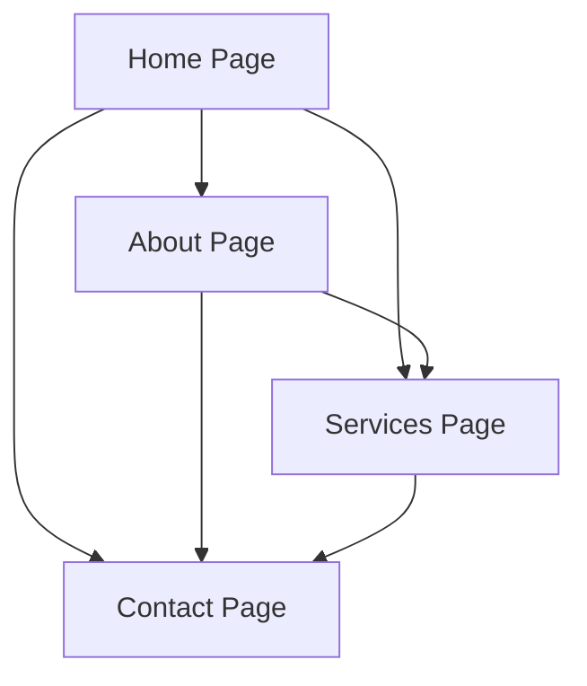

## 1. Product Overview
A modern, visually striking website for a deep tech talent agency featuring animated backgrounds and interactive category cards. The website showcases cutting-edge technology sectors with smooth animations and a premium aesthetic that appeals to both talent and companies in the deep tech space.

The product solves the need for a compelling online presence that effectively communicates expertise in emerging technology sectors while providing an engaging user experience through motion design and interactive elements.

## 2. Core Features

### 2.1 User Roles
This website serves as a company showcase and does not require user authentication or role-based access.

### 2.2 Feature Module
The website consists of the following main pages:
1. **Home page**: animated hero section with moving background, company introduction, animated category cards for technology sectors.
2. **About page**: company mission, team information, company values and culture.
3. **Services page**: detailed service offerings, process overview, client testimonials.
4. **Contact page**: contact form, office locations, social media links.

### 2.3 Page Details
| Page Name | Module Name | Feature description |
|-----------|-------------|---------------------|
| Home page | Animated Hero Section | Display moving gradient background with subtle particle effects, company tagline with typewriter animation, call-to-action buttons |
| Home page | Category Cards | Show interactive cards for AI, Robotics, SaaS, Biotech, Quantum Computing sectors with hover animations and scroll-triggered movements |
| Home page | Navigation | Sticky header with smooth scroll navigation, mobile-responsive hamburger menu |
| About page | Mission Section | Company vision and mission statement with fade-in animations |
| About page | Team Gallery | Team member profiles with hover effects and modal popups |
| Services page | Service Cards | Animated service offerings with expandable details |
| Services page | Process Timeline | Step-by-step process visualization with scroll animations |
| Contact page | Contact Form | Interactive form with validation and submission feedback |
| Contact page | Location Map | Embedded map with office locations and contact details |

## 3. Core Process
Users navigate through the website starting from the homepage, which showcases the animated hero section and category cards. The smooth animations guide users through the company's offerings, leading them to explore services, learn about the company, and ultimately make contact.

## 4. User Interface Design

### 4.1 Design Style
- **Primary Colors**: Deep navy (#0A0E27), Electric blue (#00D4FF), White (#FFFFFF)
- **Secondary Colors**: Light gray (#F8F9FA), Dark gray (#1A1F3A)
- **Button Style**: Rounded corners (8px radius), subtle shadows, hover state with color transition
- **Typography**: Inter font family, 16px base size, responsive scaling
- **Layout**: Card-based design with generous whitespace, asymmetric grids for visual interest
- **Icons**: Lucide React icons with consistent stroke width and rounded corners

### 4.2 Page Design Overview
| Page Name | Module Name | UI Elements |
|-----------|-------------|-------------|
| Home page | Hero Section | Full-screen gradient background with animated particles, centered headline with typewriter effect, two primary CTA buttons with hover animations |
| Home page | Category Cards | Grid of 6 cards with sector icons, each card has 3D tilt effect on hover, cards animate in sequence on scroll |
| Navigation | Header | Transparent background that becomes opaque on scroll, logo on left, navigation links on right, mobile hamburger with slide-out menu |
| About page | Mission Section | Split layout with text on left and animated illustration on right, subtle parallax scrolling effect |
| Services page | Service Cards | Horizontal scrolling cards with snap points, each card expands on click to show detailed information |

### 4.3 Responsiveness
Desktop-first design approach with mobile adaptation. Breakpoints at 768px and 1024px. Touch interactions optimized for mobile devices with larger tap targets and swipe gestures for card navigation.

### 4.4 Animation Guidelines
- Background animations: Subtle gradient shifts every 5-8 seconds
- Category cards: 3D tilt effect on hover, entrance animations triggered by scroll position
- Page transitions: Smooth fade and slide effects between sections
- Scroll-triggered animations: Elements fade in and slide up as they enter viewport
- Performance: All animations use GPU acceleration with will-change CSS property