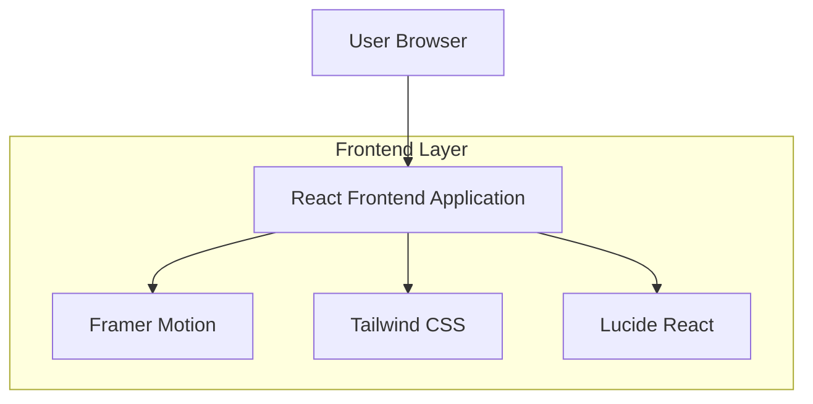

## 1. Architecture Design



## 2. Technology Description
- Frontend: React@18 + Tailwind CSS@3 + Vite
- Animation Library: Framer Motion@10
- Icons: Lucide React@0.300+
- Initialization Tool: vite-init
- Backend: None (static site)

## 3. Route Definitions
| Route | Purpose |
|-------|---------|
| / | Home page with animated hero and category cards |
| /about | Company information and team details |
| /services | Service offerings and process overview |
| /contact | Contact form and location information |

## 4. Component Architecture

### 4.1 Core Components
```typescript
// Hero Section Component
interface HeroSectionProps {
  title: string;
  subtitle: string;
  ctaButtons: Array<{
    text: string;
    href: string;
    variant: 'primary' | 'secondary';
  }>;
}

// Category Card Component
interface CategoryCardProps {
  icon: React.ReactNode;
  title: string;
  description: string;
  color: string;
  delay: number;
}

// Animated Background Component
interface AnimatedBackgroundProps {
  particleCount?: number;
  animationSpeed?: number;
  colors?: string[];
}
```

### 4.2 Animation Configuration
```typescript
// Framer Motion Variants
const fadeInUp = {
  hidden: { opacity: 0, y: 60 },
  visible: { 
    opacity: 1, 
    y: 0,
    transition: { duration: 0.6, ease: "easeOut" }
  }
};

const cardHover = {
  rest: { scale: 1, rotateX: 0, rotateY: 0 },
  hover: { 
    scale: 1.05, 
    rotateX: 5, 
    rotateY: 5,
    transition: { duration: 0.3 }
  }
};

const backgroundShift = {
  animate: {
    background: [
      "linear-gradient(135deg, #0A0E27 0%, #1A1F3A 100%)",
      "linear-gradient(135deg, #1A1F3A 0%, #0A0E27 100%)",
      "linear-gradient(135deg, #0A0E27 0%, #1A1F3A 100%)"
    ],
    transition: {
      duration: 8,
      repeat: Infinity,
      ease: "linear"
    }
  }
};
```

## 5. Performance Optimization

### 5.1 Image Optimization
- Use WebP format for all images
- Implement lazy loading for below-fold content
- Use responsive images with srcset
- Preload critical hero images

### 5.2 Animation Performance
- Use CSS transforms for all animations
- Implement will-change property for animated elements
- Use requestAnimationFrame for custom animations
- Limit animation frame rate to 60fps

### 5.3 Bundle Optimization
- Code splitting for route-based components
- Tree shaking for unused exports
- Minimize Framer Motion bundle size by importing specific functions
- Use dynamic imports for non-critical components

## 6. Responsive Design Implementation

### 6.1 Breakpoints
```css
/* Tailwind CSS Breakpoints */
/* sm: 640px */
/* md: 768px */
/* lg: 1024px */
/* xl: 1280px */
/* 2xl: 1536px */
```

### 6.2 Mobile-Specific Features
- Touch-optimized card interactions
- Swipe gestures for horizontal scrolling sections
- Larger tap targets (minimum 44px)
- Simplified animations for reduced motion preference

## 7. SEO and Accessibility

### 7.1 SEO Configuration
- Server-side rendering consideration for meta tags
- Dynamic meta descriptions per route
- Open Graph tags for social sharing
- Structured data for organization and services

### 7.2 Accessibility Features
- ARIA labels for interactive elements
- Keyboard navigation support
- Screen reader announcements for dynamic content
- Reduced motion respect for users with vestibular disorders

## 8. Deployment Configuration

### 8.1 Build Process
```bash
# Development
npm run dev

# Production Build
npm run build

# Preview Production Build
npm run preview
```

### 8.2 Static Hosting
- Compatible with Vercel, Netlify, GitHub Pages
- Configure proper MIME types for WebP images
- Set up proper caching headers for static assets
- Implement service worker for offline functionality (optional)